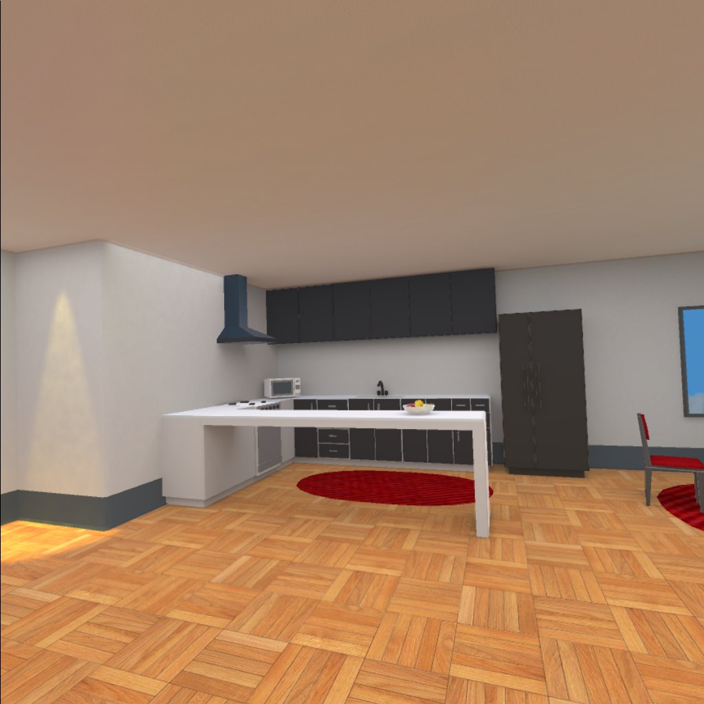
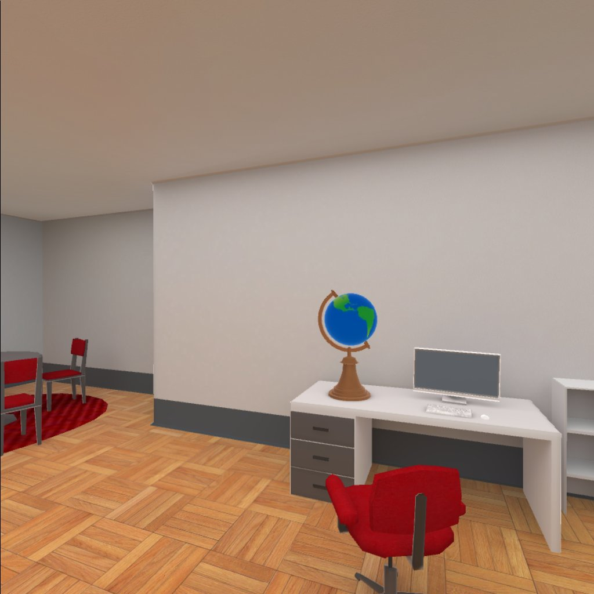

## Build an Apartment

# Introduction 
Explore an apartment in Virtual Reality using mobile devices.

The original project has been extended with the following functionalities:
- added a spinning globe actioned by the Cardboard button or headet controller.
- added a loading scene for presenting the title of the game: in the future this could be extended with instruction on how to use the game with the VR headset.
- added an audio source for simulating the external sounds from the city.
- added clock animation.

# Getting Started

### Build and Test
It's possible to test the project using Unity. If Unity is not available, an apk has been provided and can be deployed directly to an Android device.
The project has been tested using both Google Cardboard and Oculus Go but the provided apk is targeting only Google Cardboard.

#### Using Unity
Scenes required (the order should be respected): 
- Build an Apartment\Assets\UdacityVR\Scenes\Loading.Unity
- Build an Apartment\Assets\UdacityVR\Scenes\Build an Apartment.unity

Steps:
- Unzip the zip file
- Launch Unity (the project is targeting Unity 2017.4.15f1)
- Open the project located under the folder “Build an apartment"
- Open the scene "Build an apartment" to explore the hierarchy
- VR mode has been set on the Android build platform in the Build settings
- Use the menu “File->Build settings->Android->Build and Run” to run it on an Google Cardboard device. Replace the target if another platform (like Oculus Go) is required
- Explore the scene in the headset

#### Deploy to the device
If needed, a build targeting Google Cardboard has already been provided compressed into the archive "Build.zip" and can be deployed to a device using the following command from an adb command prompt:

adb install “BuildAnApartment.apk”

### Versions Used
- [Unity LTS Release 2017.4.15](https://unity3d.com/unity/qa/lts-releases?version=2017.4)
- [GVR SDK for Unity v1.170.0](https://github.com/googlevr/gvr-unity-sdk/releases/tag/v1.170.0)
- [City sounds](https://freesound.org/people/blaukreuz/sounds/252698/)
- [FPS script](http://wiki.unity3d.com/index.php/FramesPerSecond)

### Related Repositories
- [VR Scenes and Objects - Build an Apartment](https://github.com/udacity/VR-Scenes-and-Objects_Build-an-Apartment)
